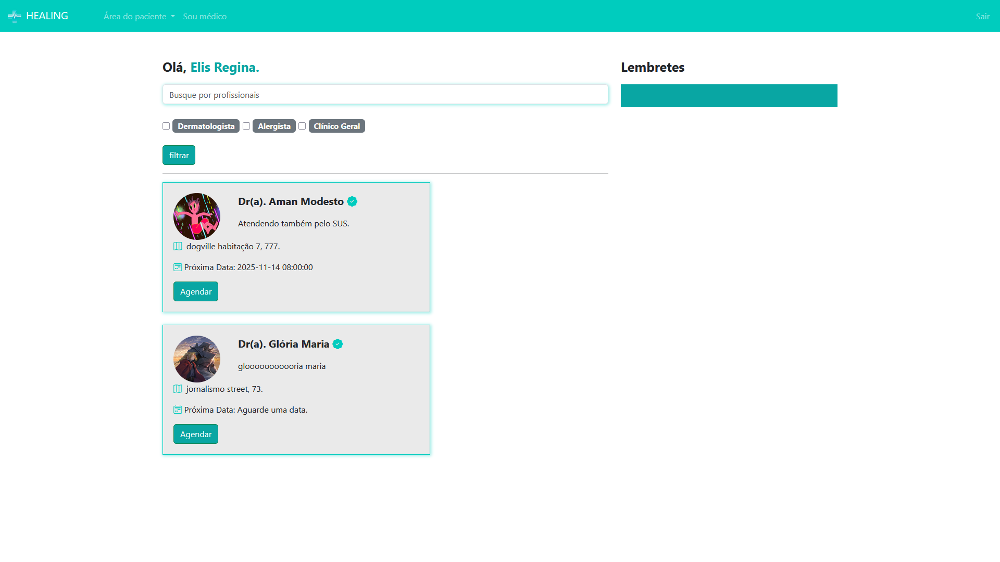
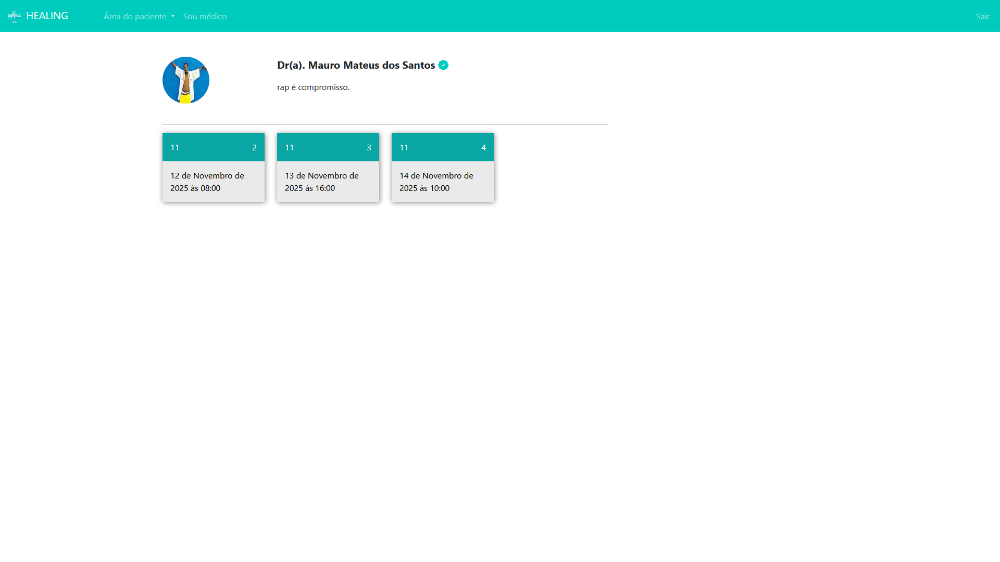
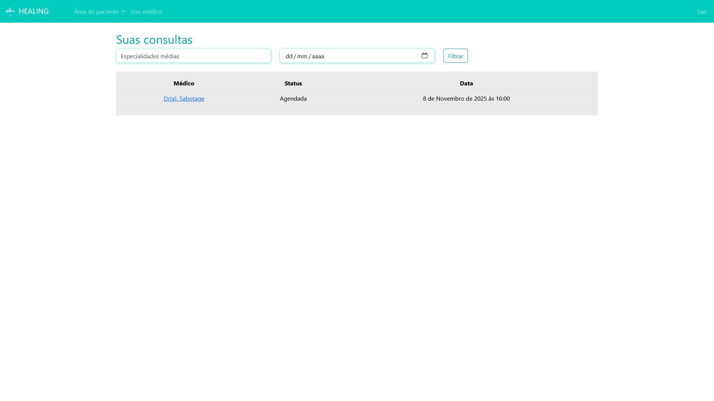
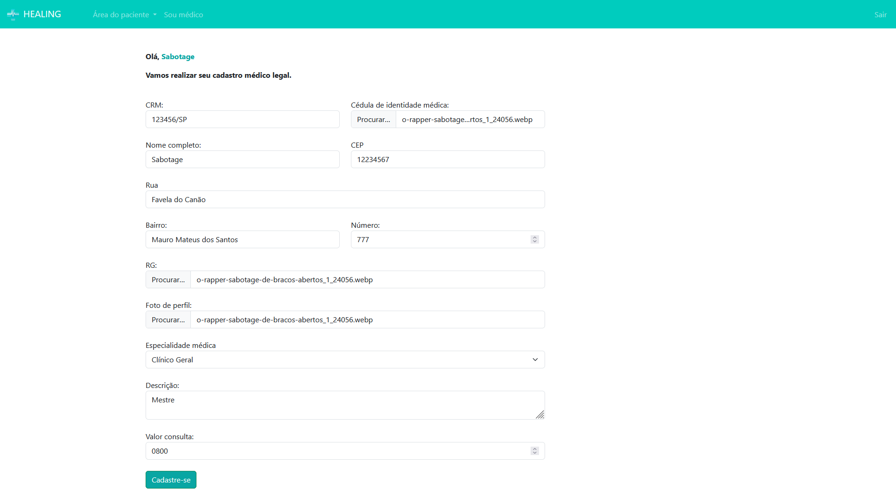
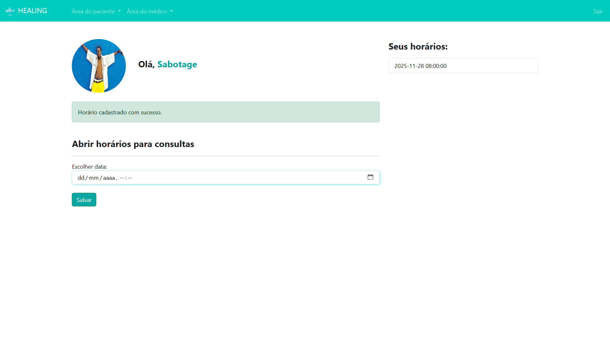
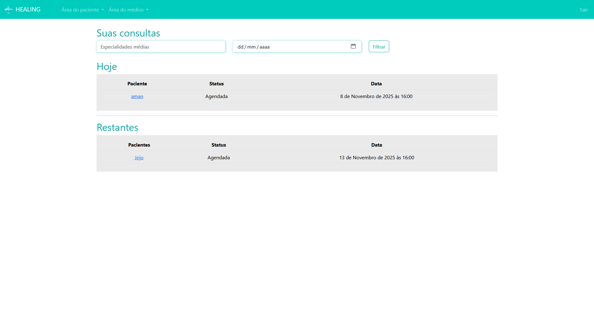
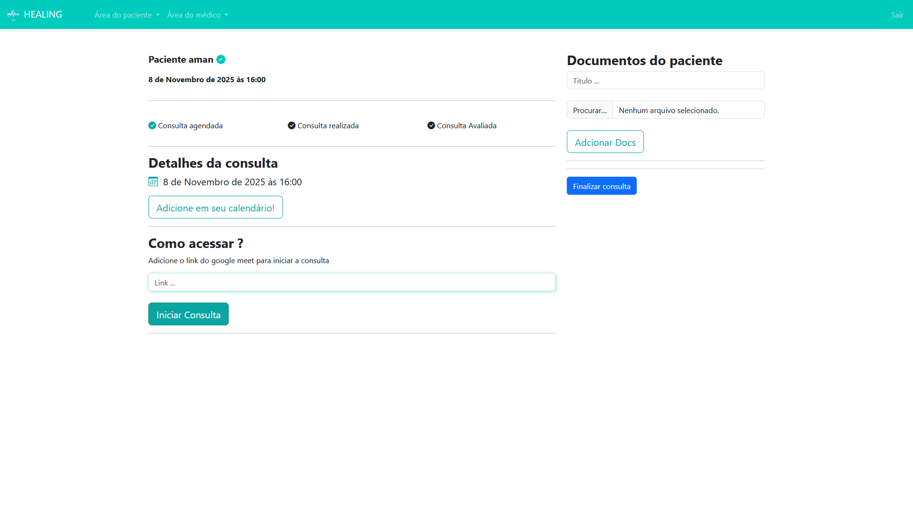
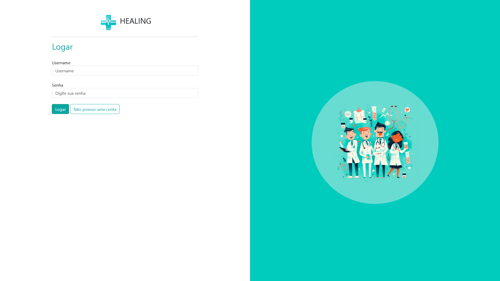
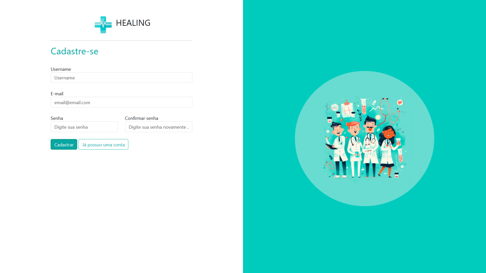

<div align="center">
  
  <h1>Healing</h1>
</div>
<p align='center'>Plataforma de telemedicina, agendamento e realização de consultas médicas, desenvolvida durante a décima edição do evento PyStack Week, conduzido pelo professor Caio Sampaio.</p>

<div align='center'>
  
  
  
  
</div>

## Interface da Aplicação
<kbd>
  
</kbd>
<kbd>
  
</kbd>  
</kbd>
<kbd>
  
</kbd>  
<kbd>
    
</kbd>
<kbd>  
    
</kbd>
<kbd>
    
</kbd>
<kbd>
    
</kbd>
<kbd>
    
</kbd>  
<kbd>
    
</kbd>  

## Rode localmente
1. Clone o repositório:
```
  git clone https://github.com/amanmdest/psw10_Healing.git
```
2. Crie e ative um *virtualenv*(Linux):
```
  python -m venv venv
  source venv/bin/activate
```
3. Instale as dependências:
```
  pip install -r requirements.txt
```
4. Migrações Banco de Dados:
```
  python manage.py makemigrations
  python manage.py migrate
```
5. Para poder usar o painel do admin é preciso criar um superuser:
```
  python manage.py createsuperuser
```
6. Rode o projeto localmente:
```
  python manage.py runserver
```
e acesse: http://127.0.0.1:8000/
